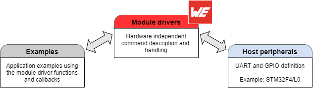

# Wireless Connectivity SDK

**Software Development Kit to use Würth Elektronik wireless connectivity products**

This SDK contains [module drivers](WCON_SDK/WCON_Drivers) and [examples](WCON_SDK/Examples) for integrating Würth Elektronik radio modules into end devices. The following products are supported by this SDK:

**Adrastea-I, Calypso, Cordelia-I, Daphnis-I, Metis -I, Metis-II, Metis-e, Proteus-II, Proteus-III, Proteus-IV, Proteus-e, Skoll-I, Stephano-I, Tarvos-III, Tarvos-e, Telesto-III, Thebe-II, Thebe-II India, Themisto-I, Thyone-I, Thyone-e**

The [module drivers](WCON_SDK/WCON_Drivers) are hardware independent and can be ported to any host platform by copying the code. The interface to the host peripherals like UART and GPIO are used to run the [example](WCON_SDK/Examples) applications.
This SDK contains the reference implementation of the host peripherals of STM32F4 and STM32L0, which can be easily extended or replaced.

For more details, please refer to the application note [ANR008_WirelessConnectivity_Software_Development_Kit_SDK](http://www.we-online.com/ANR008).

